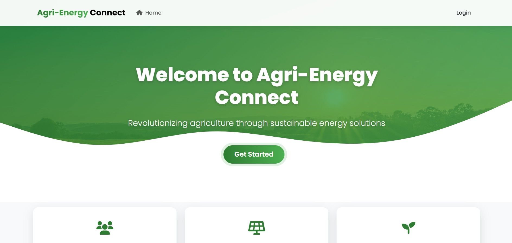
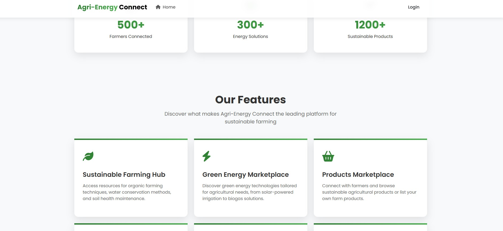
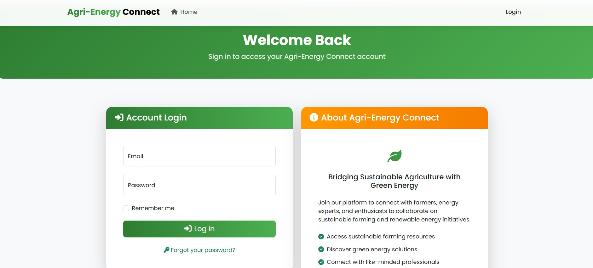
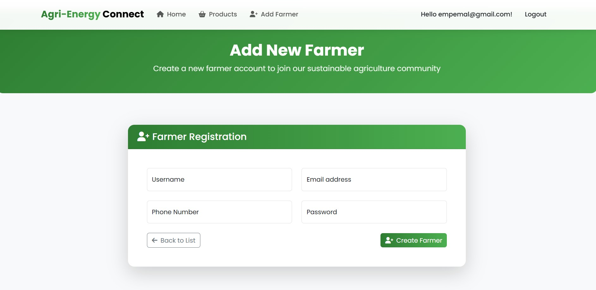
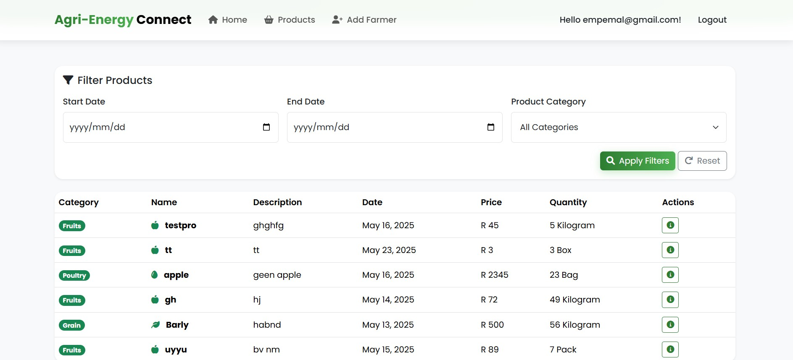
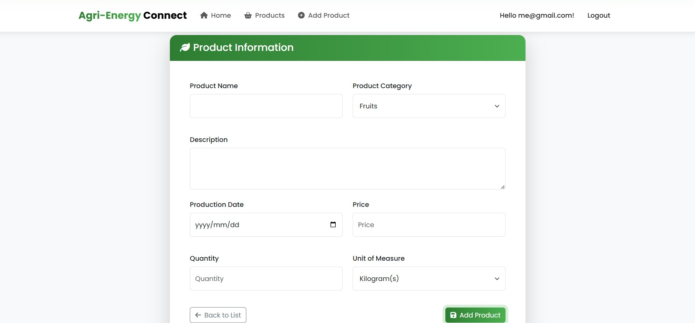
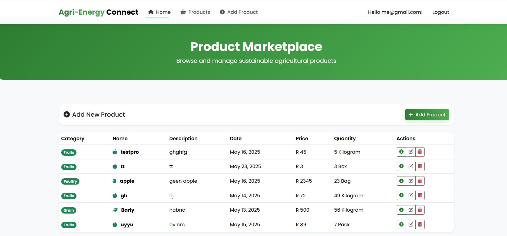
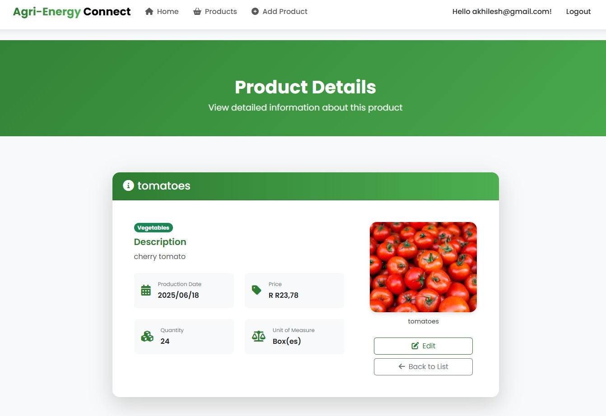
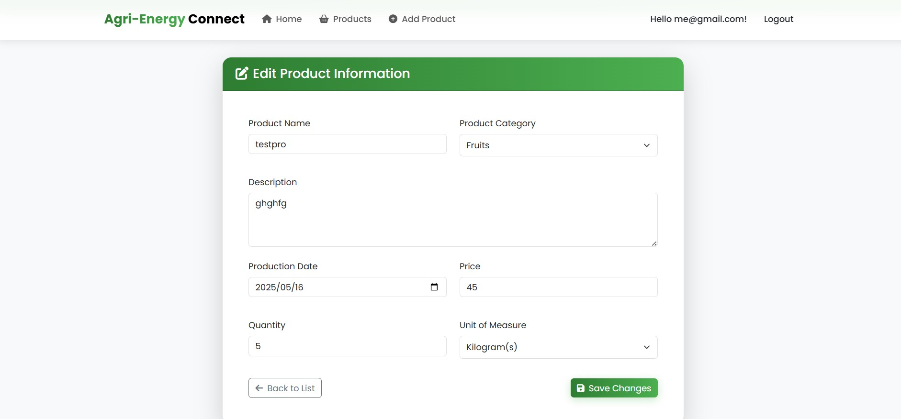
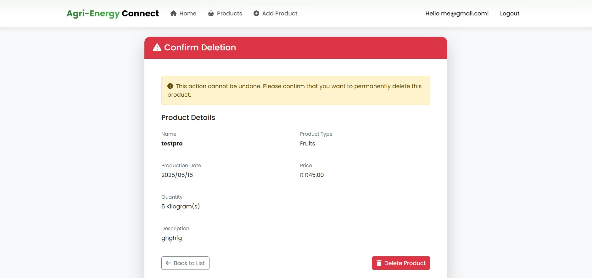

# Agri-Energy Connect Platform

## Features

### Employee Role
- Log in securely
- Add new farmer profiles
- View all farmer products
- Filter products by:
  - Date range
  - Product type

### Farmer Role
- Log in using the details the employee created for them
- Add new products by adding the following:
  - Name
  - Description
  - Product Type
  - Price
  - Quantity
  - Unit of Measure
- View a list of their own added products
- Edit or delete existing products

## Step Instructions (Prerequisites)

### Prerequisites
Before setting up, ensure you have the following installed:
- [.NET 9 SDK](https://dotnet.microsoft.com/)
- [Visual Studio 2022 or later](https://visualstudio.microsoft.com/)
- SQL Server / LocalDB
- Git (optional, for cloning the repository)

### Setup Steps

1. **Download the ZIP file** of the project from the repository or source.
2. **Extract the ZIP** and open the solution (`.sln`) file in **Visual Studio**.
3. **Open Package Manager Console** in Visual Studio:
   - Run the following command to create the migration:
     ```bash
     Add-Migration InitialCreate
     ```
   - Then update the database:
     ```bash
     Update-Database
     ```
4. **Run the application** using Visual Studio (press **F5** or click **Run**).

## Sample Data

The system includes pre-seeded employee and data for demonstration:

### Sample Employee
- **Email:** akhilesh.employee@gmail.com  
- **Password:** Pa$$w0rd

### Sample Farmer
- **Email:** akhilesh@gmail.com  
- **Password:** Pa$$w0rd

## System Walkthrough
### Normal User

**Dashboard**



**Login**


### For Employees
1. **Log in** using the provided Employee account
2. **Add a new farmer** through the Employee dashboard
3. **View all products** across all farmers
4. **Filter products** using:
   - Date range
   - Product category/type

**Add Farmer Interface:**


**View and Filter Products:**


### For Farmers
1. **Log in** using the credentials provided by an employee
2. **Add new products** by entering:
   - Product name
   - Description
   - Product type/category
   - Price
   - Quantity
   - Unit of measure
   - Production date
3. **View their products**
4. **Edit or delete products**

**Add  Products:**



**View Products:**
 

**Product Details:**
 

**Edit and Delete Products**
 
 


## YouTube Link

- YouTube Link: <https://www.youtube.com/watch?v=43ioO44XIZU>

## References
- Haritha Components & Technologies. *MVC Search Filter Records Between Two Dates ASP.NET Core Razor Pages Database* [Video Online] Available at: <https://www.youtube.com/watch?v=Bg59HwCO3yQ> [Accessed 12 May 2025].  
- tutorialsEU -C#. *ASP.NET User Roles - Create and Assign Roles for AUTHORIZATION!* [Video Online] Available at: <https://www.youtube.com/watch?v=Y6DCP-yH-9Q>  [Accessed 12 May 2025].
- OpenAI. 2024. *Chat-GPT*(Version 4.0)*. [Large language model]. Avaliabe at: <https://chatgpt.com/share/68232d50-0be4-800d-b0f4-421cc236ce20>  [Accessed 12 May 2025]

## Declarations

**Title**: Disclosure of AI Usage in my Assessment.
   - I used Chatgpt to check my work, explain certain concepts and for general error handling. 
     - I used to check for an error on why the farmer could not log in
     - Explaining filtering by a date range
     - What unit of measure to have in the enum
     - Checking my validations and data annotations for the product and farmer models.
  - [Accessed 12 May 2025]
  - Chat-GPT(Version 4.0)
  - <https://chatgpt.com/share/68232d50-0be4-800d-b0f4-421cc236ce20>


 

